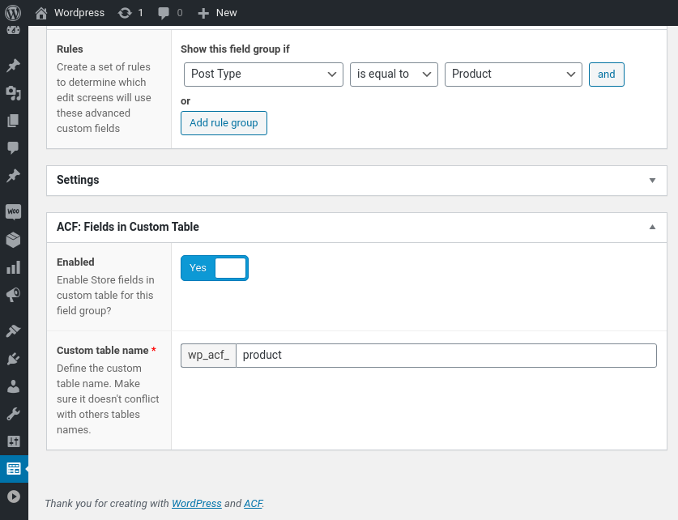

# ACF: Fields in Custom Table

This ACF plugin makes it possible to store ACF data in structured database tables instead of WordPress core meta tables.

It uses ACF's `acf/update_field_group` hook to create/update the database and then uses `acf/save_post` hook to store the data.

It was heavily inspired by Austin Ginder's post [https://anchor.host/acf-custom-fields-stored-in-custom-table/](https://anchor.host/acf-custom-fields-stored-in-custom-table/).


## Supported Fields

- Text
- Text Area
- Number
- Range
- Email
- URL
- Password
- Image
- File
- Wysiwyg Editor
- oEmbed
- Select
- Checkbox
- Radio Button
- Button Group
- True / False
- Date Picker
- Date Time Picker
- Time Picker
- Color Picker
- Link
- Post Object
- Page Link
- Relationship
- Taxonomy
- User

## Relational Fields =

This plugin supports the following relational field types: Post Object, Page Link, Relationship, Taxonomy and User.

It can store both single and multiple values based on the `multiple` option.

* If it's a single value field, then the column type will be `bigint(20) unsigned`
* If it's a multiple value field, then the column type will be longtext and the date will be stored in json format.

You can query relational fields with multiple values using using MySQL's function [JSON_CONTAINS](https://dev.mysql.com/doc/refman/5.7/en/json-search-functions.html#function_json-contains).
Here is an example:

Table:

```
+---------+-------------------+--------+
| post_id |       title       | stores |
+---------+-------------------+--------+
|       1 | Lord of the Flies | [1,2]  |
|       2 | The Island        | [2]    |
|       3 | 1984              | [3]    |
+---------+-------------------+--------+
```

Query:

```sql
SELECT * FROM wp_acf_books WHERE JSON_CONTAINS(stores, 2, '$')
```

The query above will return "Lord of the Flies" and "The Island"

## ACF Compatibility

This plugin was testes with *ACF 5 FREE Version* .

## Screenshots


